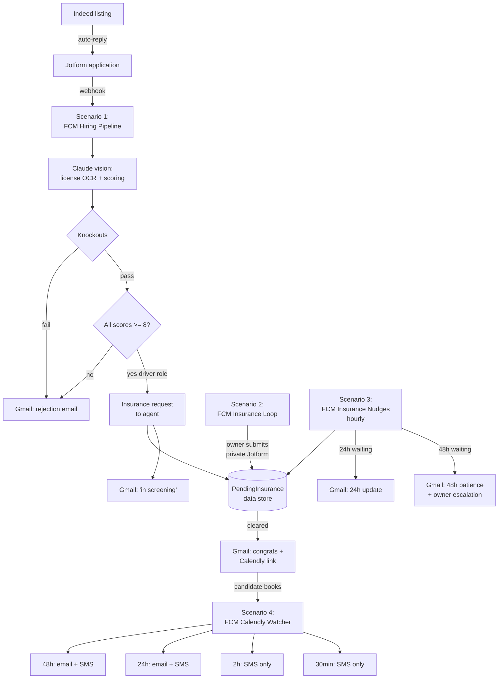

# HirePipe — Moving Company Hiring Pipeline

Four-scenario Make.com hiring automation for a moving / home-services company. Reads driver's licenses with Claude vision, applies a knockout-then-score rubric, routes pass/fail, manages an insurance-verification loop with operator escalation, and sends interview reminders at 48h / 24h / 2h / 30min via SMS + email.

## What this repo demonstrates

The orchestration is **four Make.com scenarios** sharing state via a Make data store. The defensible technical work — the license-OCR-and-score prompt, the knockout rubric, the reminder scheduling logic — is in Python here. The Make scenarios call this as HTTP services or paste the equivalent logic into Make functions.

Per the original brief, the client had a fully written 25-page blueprint covering every module, prompt, email, SMS, and decision flow. **The job was to execute, not to design.** This repo executes the blueprint cleanly with synthetic applicant data.

## Architecture



## The four scenarios

| # | Scenario | Trigger | Output |
| --- | --- | --- | --- |
| **1** | FCM Hiring Pipeline | Jotform submission webhook | License parsed, applicant scored, routed: reject / in-screening / insurance-request |
| **2** | FCM Insurance Loop | Owner submits private "clear this candidate" Jotform | Candidate cleared → congrats + Calendly email |
| **3** | FCM Insurance Nudges | Hourly cron | 24h candidate update; 48h patience email + owner escalation |
| **4** | FCM Calendly Booking Watcher | Calendly `invitee.created` event | 4 reminders scheduled (48h/24h/2h/30min) via Twilio + Gmail |

Each scenario has a corresponding entry in `src/scenarios/` describing the Make modules in order and the data contracts between them.

## License OCR + scoring

Claude vision receives the license image + the applicant's form answers. It returns a structured JSON with extracted fields and 1-10 scores in four categories:

| Category | What it measures |
| --- | --- |
| `experience` | Years of relevant work, role progression |
| `availability` | Schedule flexibility, Saturday willingness |
| `professionalism` | Quality of answers, attention to detail |
| `physical_capability` | Self-reported physical readiness for moving work |

A passing application has **all four scores ≥ 8** *and* clears the knockout questions.

The prompt lives in `prompts/license_extraction.md` and is heavily commented so a non-author can tune it.

## Knockout questions

| Question | Fail condition |
| --- | --- |
| Can you work Saturdays? | "no" |
| Can you pass a standard drug screen? | "no" |
| Do you have reliable transportation to our facility? | "no" |
| Are you 21 or older? | "no" |
| Is your driver's license valid in this state? | "no" (only for driver roles) |

Knockouts are evaluated **before** the score check — a knockout fail goes straight to the rejection branch even if the scores would have passed.

## Layout

```
hirepipe/
  README.md
  prompts/
    license_extraction.md      # Claude vision prompt (system + structured output schema)
  config/
    knockout_questions.json    # Editable rubric
    scoring_threshold.json     # Pass cutoff per role
    email_templates/           # Rejection, screening, congrats, nudge, escalation
    sms_templates/             # 48/24/2/30 reminder copy
  src/
    models.py                  # Applicant, ScoredApplication, etc.
    license_scorer.py          # Claude vision wrapper (live + mock)
    knockouts.py
    routing.py                 # Score + branch decisions
    pipeline.py                # Scenario 1 logic in Python
    insurance_loop.py          # Scenario 2 + 3
    reminders.py               # Scenario 4 schedule builder
    state_store.py             # JSON-backed pending state
    scenarios/                 # Per-scenario Make module breakdowns
  data/
    applications/              # Mock Jotform submissions
    output/                    # Per-applicant artifacts
  scripts/
    run_pipeline.py            # End-to-end demo across mock applicants
    seed_applications.py
  tests/
    test_knockouts.py
    test_routing.py
    test_reminders.py
```

## Run the demo

```powershell
python scripts\seed_applications.py
python scripts\run_pipeline.py
```

The demo walks each mock applicant through the full pipeline, prints the decisions inline, and writes per-applicant audit artifacts (extracted license JSON, score sheet, decision trace, generated emails, generated SMS) to `data\output\`.

## Going live in Make

Each Python module here has a 1:1 mapping to a Make scenario module. The detailed mapping lives in `src/scenarios/*.md` — one document per scenario.

| What needs the platform | What's in this repo |
| --- | --- |
| Jotform webhook | Scenario 1 trigger |
| Anthropic Claude vision module | `prompts/license_extraction.md` (the system prompt + schema) |
| Make Data Store ("PendingInsurance") | `src/state_store.py` (interface + JSON impl) |
| Gmail send | `config/email_templates/*.md` |
| Twilio SMS | `config/sms_templates/*.md` |
| Calendly webhook | Scenario 4 trigger |

## Status

- License OCR prompt + structured-output schema: written
- Knockout + scoring rubric: built + tested
- Routing logic (pass/fail/insurance/role-branch): built + tested
- Reminder scheduler (48/24/2/30 cadence): built + tested
- All 4 scenarios documented module-by-module
- 5 mock applicant submissions covering all paths
- End-to-end pipeline demo runs and emits audit trail
- 12 tests passing
